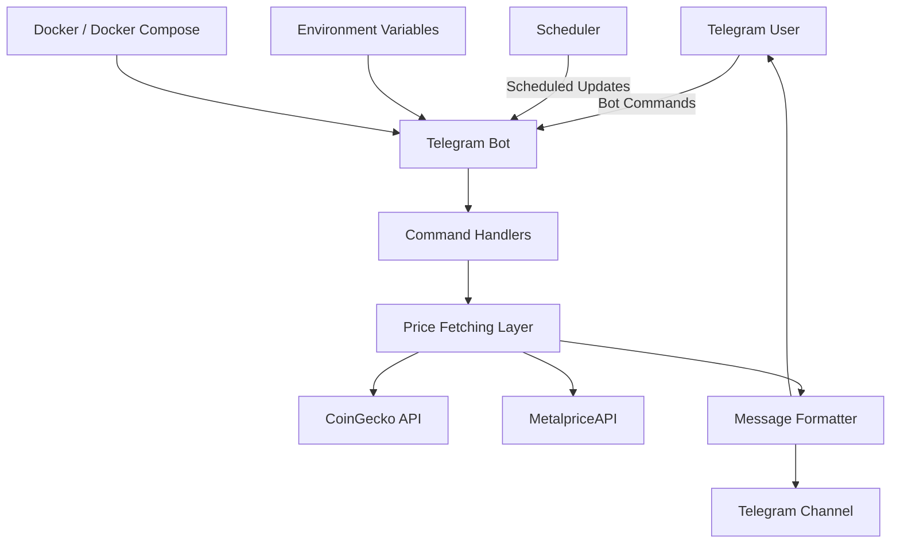

# Project Architecture

This document provides an overview of the Telegram Asset Price Bot architecture.

## Components

### Telegram Bot

Receives commands from Telegram users and coordinates the application workflow.

### Command Handlers

Processes commands such as `/start` and `/prices`.

### Price Fetching Layer

Retrieves cryptocurrency and precious-metal prices from external APIs.

### Scheduler

Runs automatic price updates at configured intervals.

### Message Formatter

Formats fetched prices into readable Telegram messages.

### Telegram Channel

Receives scheduled asset-price updates automatically.

### Environment Variables

Stores configuration values such as Telegram tokens, API keys, channel IDs, and scheduling settings.

### Docker

Provides a consistent and portable environment for running the application.