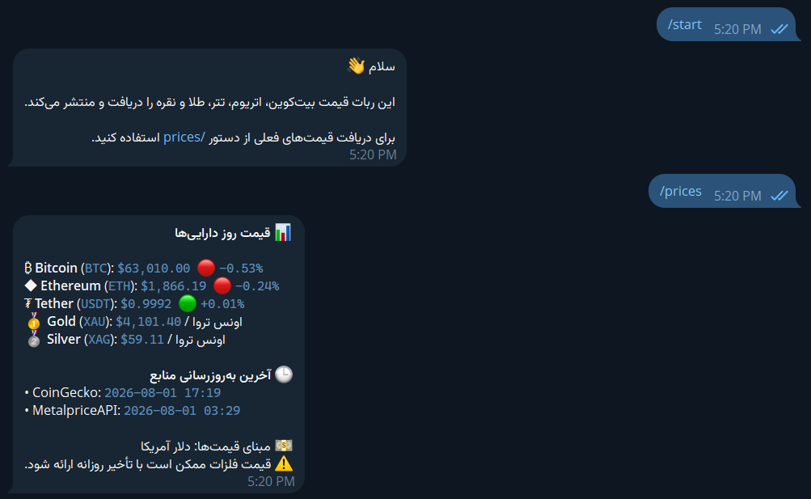

# Telegram Asset Price Bot

[](https://github.com/milad5108/telegram-asset-price-bot/actions/workflows/ci.yml)




> **Production-ready Telegram bot for cryptocurrency and precious-metal
> price tracking with Python, Docker and Telegram Bot API.**

------------------------------------------------------------------------

## Overview

Telegram Asset Price Bot retrieves live cryptocurrency and
precious-metal prices from external APIs and publishes beautifully
formatted reports directly to Telegram.

### Current Features

-   Live cryptocurrency prices
-   Live gold & silver prices
-   `/start` and `/prices` commands
-   Channel support
-   Daily scheduled posting
-   Async architecture
-   Docker & Docker Compose support
-   Automated testing
-   Ruff linting

------------------------------------------------------------------------

## Tech Stack

-   Python 3.12
-   python-telegram-bot
-   AsyncIO
-   CoinGecko API
-   MetalpriceAPI
-   Pytest
-   Ruff
-   Docker
-   Docker Compose
-   Git & GitHub

------------------------------------------------------------------------

## Project Structure

``` text
telegram-asset-price-bot/
├── bot/
├── tests/
├── Dockerfile
├── docker-compose.yml
├── .env.example
├── requirements.txt
└── README.md
```

------------------------------------------------------------------------

## Quick Start

``` bash
git clone https://github.com/milad5108/telegram-asset-price-bot.git
cd telegram-asset-price-bot
python -m venv .venv
```

Install dependencies:

``` bash
pip install -r requirements.txt
```

Create environment file:

``` bash
cp .env.example .env
```

Run locally:

``` bash
python -m bot.main
```

------------------------------------------------------------------------

## Docker

Build:

``` bash
docker build -t telegram-asset-price-bot:latest .
```

Run:

``` bash
docker run --rm --name telegram-asset-price-bot --env-file .env telegram-asset-price-bot:latest
```

Compose:

``` bash
docker compose up -d --build
```

------------------------------------------------------------------------

## Testing

``` bash
ruff check .
pytest
```

------------------------------------------------------------------------

## Roadmap

-   [x] Telegram commands
-   [x] Scheduler
-   [x] Docker
-   [x] Docker Compose
-   [ ] GitHub Actions
-   [ ] Release v1.0.0
-   [ ] Screenshots
-   [ ] Ubuntu deployment guide

------------------------------------------------------------------------

## Author

**Milad**

GitHub: https://github.com/milad5108

------------------------------------------------------------------------

## License

This project is intended for educational and portfolio purposes.

A formal MIT License will be added in a future release.